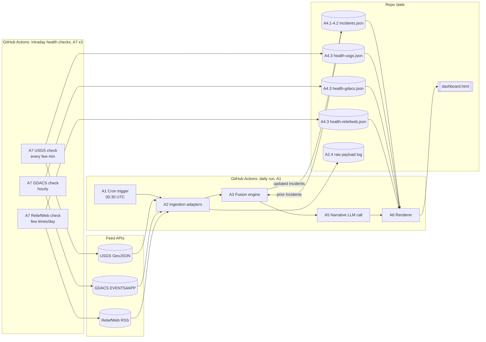

# HADR Monitor — Shaping

See `FRAME.md` for Source/Problem/Outcome. Requirements below are drawn
from `REQS.md`, `CONTEXT.md`, `docs/PRD.md`, and `docs/adr/0001`–`0008` —
restated as needs, not as the mechanisms those ADRs already chose to meet
them (mechanisms belong in Shapes, once we get there). One requirement,
R7, is new: it surfaced from a plain question ("how does it notify me?")
that no existing doc had actually answered.

## Requirements (R)

| ID | Requirement | Status |
|----|-------------|--------|
| R0 | The daily report shows one entry per real-world disaster, regardless of how many raw feed rows or how many feeds reported it (a mainshock + 200 aftershocks is one line, not 200; the same quake seen by two feeds is one line, not two). | Core goal |
| R1 | Every entry is honestly labeled by how it was corroborated — and a shared-sensor agreement (GDACS+USGS earthquake, both sourced from NEIC) must never be presented the same way as independent confirmation. | Must-have |
| R2 | A day with nothing to report is visibly distinguishable from a day where a feed could not be reached — the reader is never left to wonder which happened. | Must-have |
| R3 | When a previously reported entry (a match, a magnitude, a merge) later turns out wrong, the next report says so explicitly — never a silent correction. | Must-have |
| R4 | Hazard coverage spans what the feeds actually carry, not just earthquakes. | Must-have |
| R4.1 | Earthquake matching/coverage is fully worked out (tightest data, richest cross-feed corroboration). | Must-have |
| R4.2 | Cyclone matching/coverage is fully worked out. | Must-have |
| R4.3 | Flood, volcano, drought, wildfire, and humanitarian-only crises with no instrument equivalent (e.g. disease outbreaks) are reportable, even if only on conservative/default handling rather than tuned. | Nice-to-have |
| R5 | When multiple feeds estimate impact/who's affected, the reader can see which feed said what — never one blended number presented as settled fact. | Must-have |
| R6 | Runs unattended on a fixed daily cadence, polling each feed no faster than that feed's own update tempo. | Core goal |
| R7 | 🟡 A push channel (email, Slack, etc.) that actively reaches the reader. | 🟡 Out |
| R8 | Matching/fusion logic is scoped to these three named feeds and their known shapes. | Out (explicit non-goal — see R8.1) |
| R8.1 | A general-purpose, arbitrary-feed entity-resolution library. | Out |
| R8.2 | Real-time / sub-minute latency. | Out |

**Notes:**
- 🟡 R7 resolved: **dashboard-only, no push channel.** Publishing
  `dashboard.html` was already fixed by `README.md` as the delivery
  mechanism, not a decision this shaping process reopens — the only
  genuinely open question was whether something *additional* pushes the
  reader (email, Slack, etc.) on top of that. Decided no: the reader is
  expected to visit the page themselves. This resolves "stays quiet when
  nothing has changed" unambiguously as *the page's content doesn't grow
  that day* — there is no separate push to suppress, so no new
  push-can-fail-silently failure mode (which would have been a fresh
  instance of the R2 problem) is introduced.
- R8/R8.1/R8.2 are listed as explicit "Out" rows (not omitted) so scope
  creep back into them has to clear a visible bar, matching how
  `REQS.md`'s own Out of Scope section already treated them.

## Shapes (S)

The ADRs already fixed *what* correct fusion looks like (the matching
rule, the tiers, the state machine). What's still genuinely open is
*where the judgment calls live at runtime* — in deterministic code, in an
LLM reasoning fresh each run, or split between the two. That's the axis
these three shapes vary on; everything else about them is identical.

### A: Deterministic fusion, LLM narrates only — **SELECTED**

| Part | Mechanism | Flag |
|------|-----------|:---:|
| **A1** | Scheduled trigger: GitHub Actions cron fires the pipeline at 08:30 SGT (UTC-converted cron) | |
| **A2** | Ingestion adapters: one deterministic fetcher per feed (USGS JSON, GDACS JSON, ReliefWeb RSS), normalizing raw payloads into the Event shape from `docs/PRD.md` | |
| **A3** | Fusion engine: pure functions implementing the matching rule (ADR 0001), confidence tiers (ADR 0002), state-machine transitions (ADR 0003), and corrections/un-merge (ADR 0004) — Events in, Incidents out, same output for the same input every time | |
| **A4** | State store: Incidents + feed-health records as a JSON file, read at the start of each run and committed back to the repo at the end | |
| **A5** | Narrative pass: one LLM call per Incident to phrase the sitrep line's prose from the already-computed Incident record — the LLM only writes words, it never decides a tier, a match, or a transition | |
| **A6** | Renderer: fills `dashboard.html` from the Incident list, health records, and narrative text | |

### B: Fully agentic — a Claude Code skill drives the entire run

| Part | Mechanism | Flag |
|------|-----------|:---:|
| **B1** | Scheduled trigger: a headless Claude Code run of a purpose-built skill, invoked on a schedule (GitHub Actions or an equivalent overnight-loop runner) at 08:30 SGT | |
| **B2** | The skill's own instructions encode the matching rule, confidence tiers, state machine, and corrections policy (ADR 0001–0004, 0008) as guidance the agent applies fresh each run, not as separate code | ⚠️ |
| **B3** | The agent fetches all three feeds itself via tool calls, reads the prior run's state file, and reasons out matching/tiers/transitions/errata directly | ⚠️ |
| **B4** | State store: same Incident+health JSON shape as A4, but the agent reads and authors updates to it itself each run | |
| **B5** | The agent writes `dashboard.html` directly, in prose, at the end of its run | |

### C: Hybrid — deterministic pipeline, LLM judges matching only

| Part | Mechanism | Flag |
|------|-----------|:---:|
| **C1** | Scheduled trigger: identical to A1 | |
| **C2** | Ingestion adapters: identical to A2 | |
| **C3** | Matching/corroboration step: a coarse deterministic pre-filter groups same-hazard-type Events by rough time/geo proximity; one LLM call per candidate cluster then judges whether they're the same Incident and assigns the confidence tier, using ADR 0001/0002 as its rubric | ⚠️ |
| **C4** | Everything downstream of a settled match — state-machine transitions, closing, erratum generation — is deterministic code operating on C3's output, same logic as A3 | |
| **C5** | State store: identical to A4 | |
| **C6** | Renderer: identical to A6 (templated, not agent-authored prose) | |

## Fit Check

| Req | Requirement | Status | A | B | C |
|-----|-------------|--------|---|---|---|
| R0 | One entry per real-world disaster, however many rows/feeds reported it | Core goal | ✅ | ❌ | ❌ |
| R1 | Honest confidence labeling — shared-sensor ≠ independent confirmation | Must-have | ✅ | ❌ | ❌ |
| R2 | Quiet vs. blind must be visibly distinguishable | Must-have | ✅ | ✅ | ✅ |
| R3 | Corrections are always explicit, never silent | Must-have | ✅ | ❌ | ✅ |
| R4.1 | Earthquake matching/coverage fully worked out | Must-have | ✅ | ❌ | ❌ |
| R4.2 | Cyclone matching/coverage fully worked out | Must-have | ✅ | ❌ | ❌ |
| R4.3 | Other hazards reportable, defaults acceptable | Nice-to-have | ✅ | ❌ | ❌ |
| R5 | Impact estimates shown per-source, never blended | Must-have | ✅ | ❌ | ✅ |
| R6 | Unattended, scheduled, polite to each feed's tempo | Core goal | ✅ | ✅ | ✅ |

**Notes:**
- **B fails R0/R1/R4.x**: B2/B3 are flagged — there's no known mechanism
  yet for an LLM to apply the exact matching/tier rule with the same
  recall every run, and a flag is a failure until resolved, not a
  judgment that it's impossible.
- **B fails R5**: B5 has the agent author the whole sitrep as prose,
  which risks paraphrasing/blending per-source impact estimates into one
  narrative sentence rather than literally listing them separately, the
  way A6/C6's templated renderer does by construction.
- **C fails R0/R1/R4.x for the same underlying reason as B**, but more
  narrowly — only C3 (the matching/tier judgment) is flagged. Everything
  downstream of a settled match (C4) is deterministic, which is exactly
  why C passes R3 and R5 where B does not: by the time a correction or a
  rendered line is produced, the fuzzy part is already done.
- **R4.3 nuance**: ReliefWeb-only `Other` hazards (ADR 0008) are never
  cross-matched at all, so they don't touch B2/B3/C3 regardless of shape —
  the ❌ above is really about Flood/Volcano/Drought/Wildfire, which do
  still route through matching (with default, untuned parameters) even
  under "nice-to-have" coverage.
- **A has no flags**, but that's a property of not having decided the
  hard part yet, not evidence it's easier — B/C isolate the same
  uncertainty (can an LLM reliably reproduce a precise spatial/temporal
  matching rule) that A avoids entirely by not delegating it. A's
  cleanliness here is exactly what an early, undetailed shape sketch
  looks like before spikes have had a chance to find its own hidden
  unknowns.

## Selected Shape: A

**Fit check, R × A:**

| Req | Requirement | Status | A |
|-----|-------------|--------|---|
| R0 | One entry per real-world disaster, however many rows/feeds reported it | Core goal | ✅ |
| R1 | Honest confidence labeling — shared-sensor ≠ independent confirmation | Must-have | ✅ |
| R2 | Quiet vs. blind must be visibly distinguishable | Must-have | ✅ |
| R3 | Corrections are always explicit, never silent | Must-have | ✅ |
| R4.1 | Earthquake matching/coverage fully worked out | Must-have | ✅ |
| R4.2 | Cyclone matching/coverage fully worked out | Must-have | ✅ |
| R4.3 | Other hazards reportable, defaults acceptable | Nice-to-have | ✅ |
| R5 | Impact estimates shown per-source, never blended | Must-have | ✅ |
| R6 | Unattended, scheduled, polite to each feed's tempo | Core goal | ✅ |

**What's unsolved:** nothing at the requirement level — A has no ❌ rows.
But "no ❌" was true at the shape-sketch level of detail, before anything
was broken into concrete components. Detailing below (Detail A) surfaces
three new flagged unknowns that the sketch was too coarse to see. Per the
shaping skill's own rule, a shape isn't actually ready until those are
resolved too, even though they don't show up against any R row above.

## Detail A: concrete components

### A1 — Scheduled trigger

| Part | Mechanism | Flag |
|------|-----------|:---:|
| A1.1 | GitHub Actions workflow, cron schedule set to `30 0 * * *` UTC (= 08:30 SGT, UTC+8) | |
| A1.2 | Workflow checks out the repo (needed for A4's committed state file) and runs the pipeline entrypoint | |

### A2 — Ingestion adapters

| Part | Mechanism | Flag |
|------|-----------|:---:|
| A2.1 | USGS adapter — `4.5_day` for new-Incident detection; `all_day` filtered to existing tracked Incidents' windows for aftershocks (ADR 0006); drops non-`earthquake` `type`s (ADR 0008); normalizes epoch-ms → UTC; stores the full `ids` alias list, not just `id` (ADR 0001) | |
| A2.2 | GDACS adapter — fetches `EVENTS4APP`; logs a truncation-risk warning when a response has exactly 100 features (ADR 0006); normalizes naive-UTC timestamps; maps `eventtype` to the hazard-type taxonomy (ADR 0008); flattens Episodes into their parent Event, never as separate Events (ADR 0001); stores full `eventid` alias handling | |
| A2.3 | ReliefWeb adapter — parses the RSS feed (ADR 0006); extracts GLIDE from the `tag glide` div; maps hazard type to the taxonomy, `Other` when there's no GDACS equivalent (ADR 0008) | |
| A2.4 | Raw-payload logger — every adapter writes its raw fetch response verbatim (feeds the Event.raw_payload field in `docs/PRD.md`, so undocumented schema drift on GDACS's unversioned endpoint is diagnosable) | |

### A3 — Fusion engine

| Part | Mechanism | Flag |
|------|-----------|:---:|
| A3.1 | Matching function — hazard-type + time-window + geo-proximity, per-hazard-type parameters, GDACS Event granularity, alias-set intersection for both USGS and GDACS ids, GLIDE only as late confirmation (ADR 0001) | |
| A3.2 | Aftershock aggregation — reuses A3.1's window, no magnitude floor (ADR 0001) | |
| A3.3 | Confidence-tier assignment from matched-feed composition (ADR 0002) | |
| A3.4 | State-machine transition detector — fixed field allowlist per hazard type, affected-population diffed per source feed (ADR 0003) | |
| A3.5 | Closing-rule evaluator — one closing-authority feed per hazard type (ADR 0003) | |
| A3.6 | Re-evaluation / un-merge detector — re-checks existing Incident membership against A3.1 every run (ADR 0004) | |
| A3.7 | GLIDE relabeling — retroactively upgrades confidence tier in history on late arrival (ADR 0004) | |
| A3.8 | Erratum generator — un-merges, re-merges, GLIDE relabels, and upstream USGS revisions/deletions all produce an explicit erratum record (ADR 0004) | |

### A4 — State store

| Part | Mechanism | Flag |
|------|-----------|:---:|
| A4.1 | JSON schema for Incident records, matching `docs/PRD.md`'s data model — one file, written only by A1's fusion run | |
| A4.2 | Read at the start of each A1 run; written and committed back to the repo at the end — direct commit to `main` under a bot identity (`github-actions[bot]`, `contents: write`), guarded by a `concurrency` group on the workflow name so an overlapping manual re-run can't race the scheduled one | |
| A4.3 | Feed-health records split into **one file per feed** (`state/health-usgs.json`, `state/health-gdacs.json`, `state/health-reliefweb.json`), each written only by that feed's own A7 health-check job — never by A1. A1 only *reads* all three at render time. This gives every writer an exclusive file, so A1's daily commit and three independently-scheduled A7 commits never race each other | |

### A7 — Intraday health-check triggers

*Exists because of ADR 0007's amendment: the per-feed cadence it specifies
(USGS every few minutes, GDACS hourly, ReliefWeb a few times a day) needs
its own schedule, separate from A1's once-daily fusion/publish run, or an
outage can go undetected for up to 24h.*

| Part | Mechanism | Flag |
|------|-----------|:---:|
| A7.1 | Three separate GitHub Actions cron workflows, one per feed, each on that feed's own cadence (ADR 0007) | |
| A7.2 | Each invocation attempts one fetch against its own feed only — no fusion, no Incident processing — and records success/failure + timestamp into that feed's A4.3 health file | |
| A7.3 | Commits only its own single health file, bot identity, concurrency-grouped per feed — disjoint from A1's Incident-store commit and from each other's health files, so none of the four jobs (A1 + 3× A7) can conflict over the same file | |

### A5 — Narrative pass

| Part | Mechanism | Flag |
|------|-----------|:---:|
| A5.1 | One LLM call per Incident, given the already-computed record (state, tier, erratum flag) — **excluding per-source impact estimates**, producing only prose for the parts of the entry that aren't numeric facts | |
| A5.2 | Structural exclusion, not a prompt instruction: per-source impact estimates never enter A5's input or output at all. A6.1 renders them directly from the Incident record, verbatim, next to (not inside) the narrative text | |
| A5.3 | **Mechanism, revised during V1 build:** "one LLM call" is a headless Claude Code skill (`skills/sitrep/SKILL.md`), not a direct SDK call — a pre-existing `.github/workflows/sitrep.yml.disabled` placeholder in this repo already specified "a deterministic script decides whether anything changed; a headless model call runs only if it did," and README.md requires "at least one skill" as a deliverable. A1's deterministic pass sets `Incident.narrative = null` on any new/escalated/revised Incident and signals a `needs_narration` step output; the skill runs only when that's true, fills in `narrative` for pending Incidents, then calls the same deterministic renderer (`npm run render`) A6.1 already used — it never hand-writes HTML. See `implementation-notes.md` for the full account. | |

### A6 — Renderer

| Part | Mechanism | Flag |
|------|-----------|:---:|
| A6.1 | Template mapping the Incident list + health records + narrative text into `dashboard.html` — sorted by severity, confidence tier as a label, erratum entries visually distinct (ADR 0002/0004), per-source impact estimates rendered directly from A3's data, independent of A5 | |
| A6.2 | Regenerates and recommits every run, unconditionally — freshness line + full feed-health block always current, whether or not any Incident changed | |

**How the three flags resolved:**
- **A4.2** — settled as CI plumbing: a direct bot commit to `main`,
  concurrency-guarded. Ordinary, no further unknown.
- **A5.2** — resolved by narrowing scope rather than trusting a prompt.
  The LLM was never going to reliably promise not to paraphrase two
  numbers into one; the fix is that it never sees them. Per-source impact
  estimates are rendered by A6.1 straight from A3's Incident record, as
  data, not as something A5 writes prose around. A5 may still reference
  impact qualitatively ("a populated area was affected") but the actual
  figures are always structurally separate from anything the LLM
  produced.
- **A6.2** — turned out not to be a fresh decision at all, but a
  consequence already forced by **ADR 0007**: "the sitrep carries a
  health line per feed shown on every stale fetch." A health line that's
  only true as of the last day something changed isn't the health line
  ADR 0007 specified — it has to be current *every* run, which means the
  file is rewritten and recommitted every run regardless of whether any
  Incident changed. "Stays quiet" therefore means precisely: the Incident
  list doesn't grow. It has never meant the file goes untouched — a
  reader can always trust the freshness line, because it's the one thing
  guaranteed to update daily no matter what.

No flags remain. Shape A is ready per the `shaping` skill's own bar (all
parts understood, no ⚠️).

## Breadboard

### UI Affordances

*What the duty officer actually sees on `dashboard.html`. Read-only — there
are no inputs or interactive controls in this shape.*

| Affordance | Shows | Wires From |
|------------|-------|------------|
| Header / freshness line | Report generation time, current every run per A6.2 — the one thing guaranteed to update whether or not anything changed | A6.1 |
| Feed-health block | Per-feed last-successful-fetch time, always shown, every run (ADR 0007) | A4.3 (×3, one per feed) → A6.1 |
| Incident entry — narrative | Hazard type, location, state badge, confidence-tier label, prose | A3 → A5.1 → A6.1 |
| Incident entry — impact estimates | Per-source figures, listed separately, rendered directly from data — never passes through A5 | A3 → A6.1 |
| Erratum marker | Visually distinct entry for a correction (un-merge, relabel, revision, deletion) | A3.8 → A6.1 |
| No-change indicator | Incident list empty/unchanged for the day — the header and health block still update regardless | A6.2 |

### Non-UI Affordances

*Backend mechanics — scheduling, fetching, fusing, storing. No direct
visual output.*

| Affordance | Does | Wires Out |
|------------|------|-----------|
| Daily cron trigger (A1) | Fires the full pipeline once daily at 00:30 UTC | → Ingestion adapters |
| Intraday health-check triggers (A7, ×3) | Independently, per feed's own cadence: ping one feed, record success/failure | → that feed's health file only |
| USGS / GDACS / ReliefWeb adapters | Fetch + normalize each feed into Events (full run only) | → Raw payload log, → Fusion engine |
| Raw payload log | Persists verbatim responses for drift diagnosis | (terminal — write-only) |
| Fusion engine (A3.1–3.8) | Events + prior Incident state → updated Incidents | → Incident store, → Narrative pass |
| Incident store (A4.1–4.2) | Persists Incidents across runs; written only by A1, committed back to the repo | ↔ Fusion engine, → Renderer |
| Per-feed health files (A4.3, ×3) | Persist each feed's last-successful-fetch; each written only by its own A7 job | A7 → file, file → Renderer |
| Narrative pass (A5) | Incident record (no impact figures) → sitrep prose | → Renderer |
| Renderer (A6) | Incidents + all 3 health files + prose → `dashboard.html` | → UI affordances |

### Wiring

